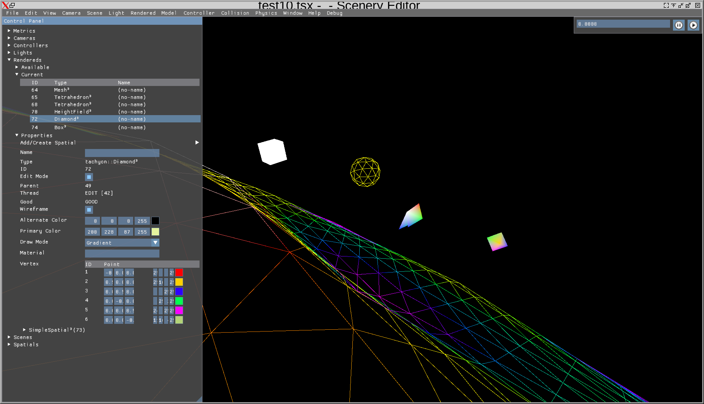

# Vulkan/Visual Engine

Vulkan/Visual Engine for my Your Quill project

***NOTICE*** (25 Dec 2025) Vulkan v1.3+ is REQUIRED with dynamic rendering.

## Examples/Apps

### Hello Triangle

Variation to the [Hello Triangle](https://vulkan-tutorial.com/)

### Cameras

Started as an exploration of cameras, became a mini move-camera, and some basics to ImGui.  Navigate with your gamepad!  (Or keyboard)

### Scenery

A scene editor!  (Still WIP)  Meant to be a way to add in objects, place them, and navigate around.

Getting more fancy

